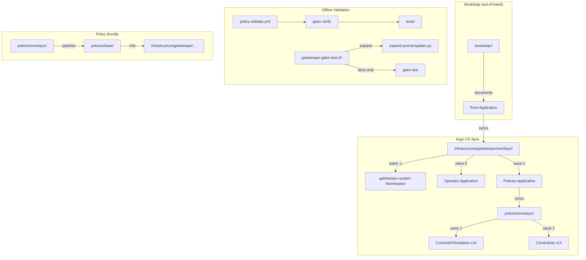
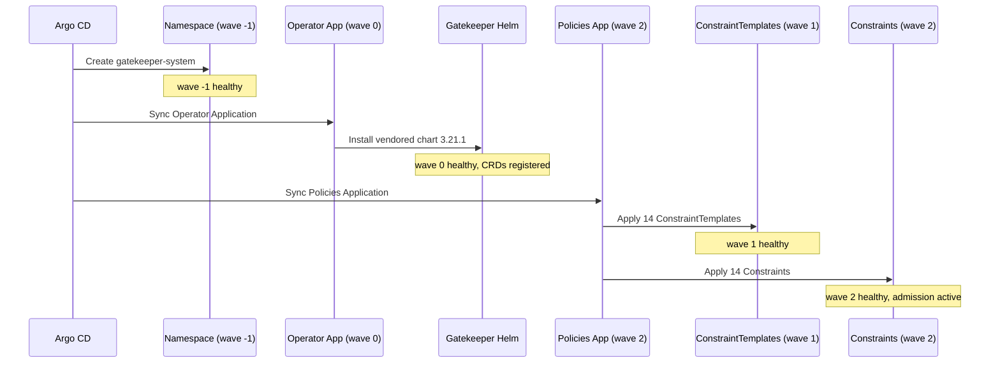
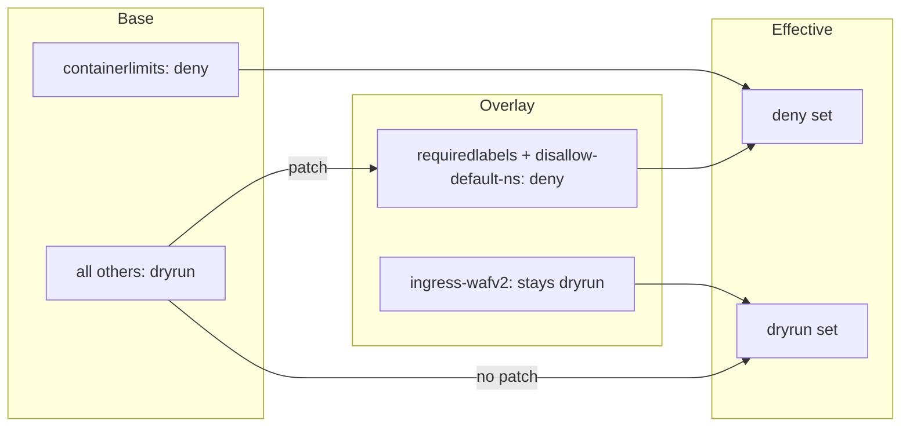
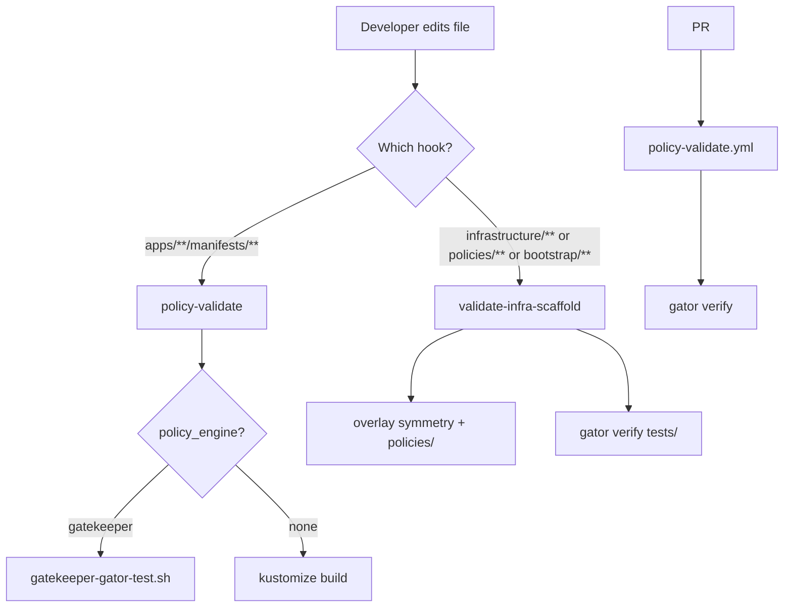

# Design Document: Gatekeeper Admission

## Overview

This design adds the full OPA Gatekeeper admission stack to this standalone repo,
adapted from `kube-infra/infrastructure/gatekeeper`. Everything needed to install and
validate admission lives in Git: vendored Helm chart **3.21.1**, 14 ConstraintTemplates,
matching Constraints, `gator verify` suites, a repo-root `policies/` Kustomize bundle
(with per-cluster enforcement promotion), nested Argo CD Applications with sync waves,
bootstrap documentation, and a CI workflow for policy PRs.

Nested Argo pattern: a cluster overlay syncs the operator (Namespace + Helm Application);
a child Policies Application syncs `policies/overlays/<cluster>/` after the operator is
healthy. Base Constraints are mostly `dryrun`; overlays promote selected Constraints to
`deny`. Offline `gator` uses the same bundle clusters will sync.

### Design Decisions

| Decision | Rationale |
| --- | --- |
| Vendor chart 3.21.1 in Git | Self-contained; no floating Helm registry at sync time |
| `policies/` at repo root | Matches existing `gatekeeper-gator-test.sh` default |
| Templates/constraints under `infrastructure/gatekeeper/` | Matches kube-infra layout; operator overlays live beside them |
| Policies Application destination namespace empty | Constraints/templates are cluster-scoped |
| `containerlimits` deny in base; labels/default-ns deny in overlays | Matches kube-infra promotion practice |
| WAF constraint stays dryrun | No real WAFv2 ACL ARNs yet |
| `owner: platform` everywhere | Project profile; never `devops` |
| Separate gator CLI pin from chart version | Chart 3.21.1 ≠ gator release tag (pin CLI, e.g. 3.22.0) |

### Out of scope (this feature)

Live cluster apply, first `apps/` scaffold, real WAF ARNs, Kyverno, kube-infra CI
checkout, Auto Mode add-ons (LB controller / EBS CSI / node lifecycle).

## Architecture

### High-Level Architecture Diagram



### Sync Wave Sequence



## Components and Interfaces

### Directory Layout

```text
infrastructure/gatekeeper/
├── base/
│   ├── namespace.yaml                    # gatekeeper-system (wave -1)
│   ├── application.yaml                  # Operator Application (wave 0)
│   └── vendored/
│       ├── README.md                     # upstream URL, 3.21.1, helm pull
│       └── chart/gatekeeper/             # vendored chart
├── constraint-templates/                 # 14 templates + kustomization.yaml
├── constraints/
│   └── <name>/                           # constraint.yaml + kustomization.yaml
├── overlays/
│   ├── dev-eks-1/
│   │   ├── kustomization.yaml
│   │   ├── application-patch.yaml
│   │   └── application-policies.yaml
│   └── prod-eks-1/
│       ├── kustomization.yaml
│       ├── application-patch.yaml
│       └── application-policies.yaml
└── tests/
    └── <constraint>/                     # suite.yaml, pass.yaml, fail.yaml

policies/
├── base/
│   └── kustomization.yaml                # aggregates templates + constraints
└── overlays/
    ├── dev-eks-1/
    │   └── kustomization.yaml            # waves + deny promotions
    └── prod-eks-1/
        └── kustomization.yaml

.github/workflows/
└── policy-validate.yml                   # gator verify on policy PRs
```

### Namespace (base/namespace.yaml)

```yaml
apiVersion: v1
kind: Namespace
metadata:
  name: gatekeeper-system
  labels:
    name: gatekeeper-system
    owner: platform
  annotations:
    argocd.argoproj.io/sync-wave: "-1"
```

### Operator Application (base/application.yaml)

Git-sourced vendored chart (not remote Helm `chart:` + registry). Helm values adapted
from kube-infra for EKS stability (`syncVAPEnforcementScope`, webhook timeouts,
readiness/liveness headroom). Keep a single `audit:` block.

```yaml
apiVersion: argoproj.io/v1alpha1
kind: Application
metadata:
  name: gatekeeper
  namespace: argocd
  labels:
    owner: platform
  annotations:
    argocd.argoproj.io/sync-wave: "0"
spec:
  project: default
  source:
    repoURL: https://github.com/jajera/kiro-eks-argocd-migration.git
    targetRevision: main
    path: infrastructure/gatekeeper/base/vendored/chart/gatekeeper
    helm:
      releaseName: gatekeeper
      values: |
        auditInterval: 60
        replicas: 1
        validatingWebhookTimeoutSeconds: 15
        mutatingWebhookTimeoutSeconds: 5
        validatingWebhookFailurePolicy: Ignore
        validatingWebhookCheckIgnoreFailurePolicy: Ignore
        metricsBackends:
          - prometheus
        syncVAPEnforcementScope: true
        controllerManager:
          readinessTimeout: 5
          livenessTimeout: 5
          resources:
            requests:
              cpu: 250m
              memory: 768Mi
            limits:
              memory: 1Gi
        audit:
          readinessTimeout: 5
          livenessTimeout: 5
  destination:
    name: in-cluster
    namespace: gatekeeper-system
  syncPolicy:
    automated:
      prune: true
      selfHeal: true
    syncOptions:
      - CreateNamespace=true
  ignoreDifferences:
    - group: apiextensions.k8s.io
      kind: CustomResourceDefinition
      jsonPointers:
        - /spec/preserveUnknownFields
        - /metadata/managedFields
        - /status
      jqPathExpressions:
        - .spec.versions[]?.preserveUnknownFields
```

CRD drift ignores stay on the **Operator** Application. Constraint/ConstraintTemplate
`.status` ignores belong on the **Policies** Application only.

### Policies Application (overlays/\<cluster\>/application-policies.yaml)

```yaml
apiVersion: argoproj.io/v1alpha1
kind: Application
metadata:
  name: gatekeeper-policies
  namespace: argocd
  labels:
    owner: platform
    argocd.argoproj.io/parent-app: gatekeeper
  annotations:
    argocd.argoproj.io/sync-wave: "2"
spec:
  project: default
  source:
    repoURL: https://github.com/jajera/kiro-eks-argocd-migration.git
    targetRevision: main
    path: policies/overlays/<cluster>
  destination:
    name: in-cluster
    namespace: ""
  syncPolicy:
    automated:
      prune: true
      selfHeal: true
  ignoreDifferences:
    # List each Constraint kind used (Argo does not reliably support kind: "*")
    - group: constraints.gatekeeper.sh
      kind: K8sContainerLimits
      jqPathExpressions: [".status"]
    - group: constraints.gatekeeper.sh
      kind: K8sRequiredLabels
      jqPathExpressions: [".status"]
    - group: constraints.gatekeeper.sh
      kind: K8sDisallowDefaultNamespace
      jqPathExpressions: [".status"]
    - group: constraints.gatekeeper.sh
      kind: K8sPSPAllowPrivilegeEscalationContainer
      jqPathExpressions: [".status"]
    - group: constraints.gatekeeper.sh
      kind: K8sNetworkPolicyEgress
      jqPathExpressions: [".status"]
    - group: constraints.gatekeeper.sh
      kind: K8sIngressWafV2
      jqPathExpressions: [".status"]
    - group: constraints.gatekeeper.sh
      kind: K8sHttpsOnly
      jqPathExpressions: [".status"]
    - group: constraints.gatekeeper.sh
      kind: K8sDisallowedTags
      jqPathExpressions: [".status"]
    - group: constraints.gatekeeper.sh
      kind: K8sBlockNodePort
      jqPathExpressions: [".status"]
    - group: constraints.gatekeeper.sh
      kind: K8sPSPPrivilegedContainer
      jqPathExpressions: [".status"]
    - group: constraints.gatekeeper.sh
      kind: K8sPSPHostNamespace
      jqPathExpressions: [".status"]
    - group: constraints.gatekeeper.sh
      kind: K8sPSPHostFilesystem
      jqPathExpressions: [".status"]
    - group: constraints.gatekeeper.sh
      kind: K8sDisallowAnonymous
      jqPathExpressions: [".status"]
    - group: constraints.gatekeeper.sh
      kind: VerifyDeprecatedAPI
      jqPathExpressions: [".status"]
    - group: templates.gatekeeper.sh
      kind: ConstraintTemplate
      jsonPointers: ["/status"]
```

Overlay `application-patch.yaml` may rename or label the parent operator Application
per cluster if needed; both clusters keep the same shape.

### Enforcement Promotion Strategy



1. Base: `containerlimits` = `deny`; all others = `dryrun`.
2. Both cluster overlays promote `namespaces-must-have-owner` and
   `disallow-default-namespace` to `deny` (kube-infra practice).
3. `ingress-wafv2-public-alb` never promoted until real regional WAFv2 ACL ARNs exist
   (YAML comment on the Constraint).
4. `gatekeeper-gator-test.sh` uses `--deny-only` so dryrun findings do not fail local runs.

### Policy Bundle Kustomize Wiring

**policies/base/kustomization.yaml** (directory refs, kube-infra style):

```yaml
apiVersion: kustomize.config.k8s.io/v1beta1
kind: Kustomization
resources:
  - ../../infrastructure/gatekeeper/constraint-templates
  - ../../infrastructure/gatekeeper/constraints/containerlimits
  - ../../infrastructure/gatekeeper/constraints/requiredlabels
  - ../../infrastructure/gatekeeper/constraints/disallow-default-namespace
  - ../../infrastructure/gatekeeper/constraints/allow-privilege-escalation
  - ../../infrastructure/gatekeeper/constraints/networkpolicy-egress-defined
  - ../../infrastructure/gatekeeper/constraints/ingress-wafv2-public-alb
  - ../../infrastructure/gatekeeper/constraints/httpsonly
  - ../../infrastructure/gatekeeper/constraints/disallowedtags
  - ../../infrastructure/gatekeeper/constraints/block-nodeport-services
  - ../../infrastructure/gatekeeper/constraints/privileged-containers
  - ../../infrastructure/gatekeeper/constraints/host-namespaces
  - ../../infrastructure/gatekeeper/constraints/host-filesystem
  - ../../infrastructure/gatekeeper/constraints/disallowanonymous
  - ../../infrastructure/gatekeeper/constraints/verifydeprecatedapi
```

**policies/overlays/\<cluster\>/kustomization.yaml**:

```yaml
apiVersion: kustomize.config.k8s.io/v1beta1
kind: Kustomization
resources:
  - ../../base
patches:
  - target:
      group: templates.gatekeeper.sh
      version: v1
      kind: ConstraintTemplate
    patch: |-
      - op: add
        path: /metadata/annotations/argocd.argoproj.io~1sync-wave
        value: "1"
  - target:
      group: constraints.gatekeeper.sh
    patch: |-
      - op: add
        path: /metadata/annotations/argocd.argoproj.io~1sync-wave
        value: "2"
      - op: add
        path: /metadata/annotations/argocd.argoproj.io~1sync-options
        value: SkipDryRunOnMissingResource=true
  - target:
      group: constraints.gatekeeper.sh
      kind: K8sRequiredLabels
      name: namespaces-must-have-owner
    patch: |-
      - op: replace
        path: /spec/enforcementAction
        value: deny
  - target:
      group: constraints.gatekeeper.sh
      kind: K8sDisallowDefaultNamespace
      name: disallow-default-namespace
    patch: |-
      - op: replace
        path: /spec/enforcementAction
        value: deny
```

### ConstraintDefaults (labels and exclusions)

- All Constraints/Applications/Namespace: `metadata.labels.owner: platform`.
- `requiredlabels` parameters require key `owner` with regex accepting non-empty values
  (including `platform`); never hard-code `devops`.
- Pod/Namespace-matching Constraints include `excludedNamespaces` for at least
  `kube-system`, `gatekeeper-system`, `argocd`, plus common EKS add-on namespaces
  used here. Do not exclude `kyverno` / `keda` — those add-ons are not in this repo.

### Gator Verify Suites

```yaml
# infrastructure/gatekeeper/tests/containerlimits/suite.yaml
apiVersion: test.gatekeeper.sh/v1alpha1
kind: Suite
metadata:
  name: containerlimits
tests:
  - name: container-must-have-limits
    template: ../../constraint-templates/containerlimits.yaml
    constraint: ../../constraints/containerlimits/constraint.yaml
    cases:
      - name: pass-all-limits-set
        object: pass.yaml
        assertions:
          - violations: "no"
      - name: fail-missing-limits
        object: fail.yaml
        assertions:
          - violations: "yes"
```

Pod-matching constraints use bare `kind: Pod` fixtures. Suites are adapted from
kube-infra `tests/` and run with:

```bash
gator verify infrastructure/gatekeeper/tests/...
```

### Bootstrap Integration

`bootstrap/dev-eks-1/` and `bootstrap/prod-eks-1/` document (and later include) a root
Application syncing `infrastructure/gatekeeper/overlays/<cluster>/`.

Apply order: Argo CD healthy → operator overlay (waves -1/0) → Policies Application
(wave 2 → templates wave 1, constraints wave 2). Until clusters exist, Git-only.

### CI Workflow

`.github/workflows/policy-validate.yml`:

- Triggers on `infrastructure/gatekeeper/**`, `policies/**`, gatekeeper scripts, and the
  workflow file itself.
- `permissions: contents: read`; pin `actions/checkout` by commit SHA (same practice as
  `kustomize-build.yml`).
- Install **gator CLI 3.22.0** via `scripts/install-gator.sh` (checksum map is the
  pin SOT; chart remains **3.21.1**).
- Run `gator verify infrastructure/gatekeeper/tests/...`; skip exit 0 if tests missing.
- Comment: add `gator test` against `apps/**` once applications exist.
- Keep `markdown-lint.yml` and `commitmsg-conform.yml` as separate required workflows.

### Reproducible local gator

Same pin as CI (`scripts/install-gator.sh`). Document version + SHA table in root README
and `policy-validation.md`. Smoke:

```bash
scripts/install-gator.sh
gator verify infrastructure/gatekeeper/tests/...
# when apps exist:
scripts/gatekeeper-gator-test.sh apps/<app>/overlays/<cluster>/manifests
```

ConstraintTemplates MUST declare `openAPIV3Schema` for `spec.parameters` (gator 3.22
rejects unknown fields). Hooks call those same entry points; they do not pick a
different version. Missing local `gator` → skip with message; CI always installs the pin.

### Steering and Hooks

When `policies/base` builds successfully:

1. Set `policy_engine: gatekeeper` in `project-profile.md`.
2. `policy-validate` hook already calls `gatekeeper-gator-test.sh` when engine is
   gatekeeper — profile flip enables it.
3. `validate-infra-scaffold` already covers `bootstrap/`, `clusters/`,
   `infrastructure/`, `policies/` — confirm policies overlays + `gator verify`.
4. Update policy-validation / manage-clusters / README docs for apply order and
   in-repo `policies/` default.
5. Missing `gator`/tools → skip with message, exit 0.

### Script Alignment

Existing `scripts/gatekeeper-gator-test.sh` already defaults to `$repo_root/policies`,
selects per-cluster overlay when present, expands pod templates, and uses
`--deny-only`. No behavioural change required once `policies/` exists; only docs if
header comments still say otherwise.

## Data Models

### Sync Wave Annotations

| Resource | Wave |
| --- | --- |
| gatekeeper-system Namespace | -1 |
| Operator Application | 0 |
| Policies Application | 2 |
| ConstraintTemplates (overlay patch) | 1 |
| Constraints (overlay patch) | 2 |

Constraints also carry `SkipDryRunOnMissingResource=true`.

### Constraint Shape (summary)

```yaml
apiVersion: constraints.gatekeeper.sh/v1beta1
kind: <CRDKind>
metadata:
  name: <constraint-name>
  labels:
    owner: platform
spec:
  enforcementAction: dryrun   # or deny
  match:
    kinds: [...]
    excludedNamespaces:
      - kube-system
      - gatekeeper-system
      - argocd
      # + EKS add-on namespaces as needed
  parameters: {}
```

## Error Handling

| Failure | Handling |
| --- | --- |
| Namespace / Helm install fails | Later waves do not progress |
| ConstraintTemplate invalid | Policies App degraded; dependent Constraints will not reconcile |
| Constraint before CRD ready | `SkipDryRunOnMissingResource` avoids false dry-run failures |
| CRD status drift | Operator `ignoreDifferences` |
| Constraint status drift | Policies `ignoreDifferences` |
| `kustomize build` / `gator verify` fail | CI/hooks non-zero with identifiable output |
| Missing tools or `policies/` | Script/hooks skip, exit 0 |
| WAF deny without ARNs | Forbidden by design — keep dryrun |

## Correctness Properties

### Property 1: Policy Bundle Build Integrity

**Validates: Requirements 4.5, 4.6, 4.7**

`kustomize build policies/base` and both overlays exit 0 with
14 templates + 14 constraints; overlays show deny on promoted Constraints only; WAF
remains dryrun.

### Property 2: Gator Verify Completeness

**Validates: Requirements 5.1, 5.2, 5.3**

Every Constraint has a suite with pass+fail; `gator verify
infrastructure/gatekeeper/tests/...` exits 0 when tooling is present.

### Property 3: Sync Wave Ordering

**Validates: Requirements 6.1, 6.2, 6.3, 6.4, 6.5**

Namespace (-1) < Operator (0) < Policies App (2); within
policies, templates (1) <= constraints (2).

### Property 4: Self-Contained Bundle

**Validates: Requirements 12.1, 12.2, 12.3, 12.4, 12.5**

No kube-infra paths in CI or script defaults; vendored chart in
Git; `policies/` uses only relative in-repo refs.

### Property 5: Hook Enablement

**Validates: Requirements 8.1, 8.2, 8.3, 8.4, 8.5**

After scaffold, `policy_engine: gatekeeper`; hooks use existing
script/verify paths without a parallel checker.

## Testing Strategy

Property-based testing does not apply. Use:

1. `gator verify` suites (unit/policy logic)
2. `kustomize build` on templates, `policies/base`, both overlays
3. CI `policy-validate.yml` on policy PRs
4. Hooks (`validate-infra-scaffold`, later `policy-validate` for apps)

### Validation Flow



### Build Matrix

| Target | Expect |
| --- | --- |
| `infrastructure/gatekeeper/constraint-templates/` | 14 templates, exit 0 |
| `policies/base` | 14 templates + 14 constraints, exit 0 |
| `policies/overlays/dev-eks-1` | promoted denies; WAF dryrun; exit 0 |
| `policies/overlays/prod-eks-1` | same as `dev-eks-1` |
