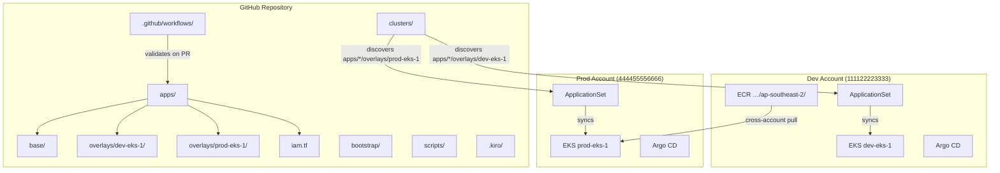
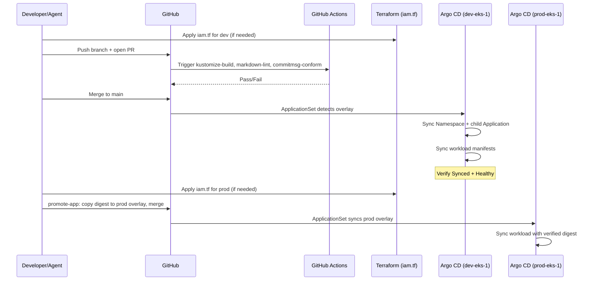
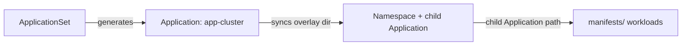
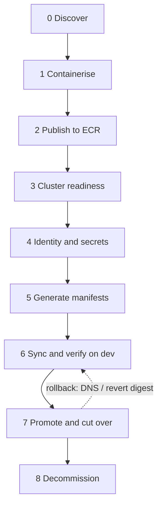

# Design Document

## Overview

This design describes the foundational platform scaffolding for the
kiro-eks-argocd-migration repository. The platform is not an application — it is the
directory structure, cluster configuration, CI pipelines, validation tooling, and
agent-assisted workflows that every future migrated workload depends on.

The platform targets two Amazon EKS clusters running in Auto Mode across separate AWS
accounts, with Argo CD as the sole delivery mechanism. Applications follow a Kustomize
base/overlay pattern, declare per-app IAM via Pod Identity, and consume secrets through
Secrets Store CSI. GitHub Actions CI validates manifests on every pull request, and Kiro
agent skills encode repeatable multi-phase workflows for migration, app creation,
promotion, and cluster management.

### Design Decisions

| Decision | Rationale |
| --- | --- |
| Single repository for manifests, bootstrap, and IAM | Eliminates cross-repo coordination; every app is self-contained |
| EKS Auto Mode | AWS manages LB controller, EBS CSI, and node lifecycle — no add-on scaffolding |
| Pod Identity over IRSA | ServiceAccounts stay annotation-free; no account IDs leak into manifests |
| `iam.tf` as a snippet, not a full root | Only policy + role + association; providers/backends stay out of band |
| Two-layer Argo CD for plain-manifest apps | Namespace creation in a separate sync wave satisfies label-gated admission |
| Both overlays required at creation time | First prod deploy should never be the first time the overlay is built |
| Digest-based promotion | Prod runs the exact bytes verified in dev; no rebuild, no cross-account copy |
| ECR repo named `<app>`, assumed to exist | Image lifecycle is owned elsewhere; this repo only references and pins digests |
| Secrets Store CSI with `usePodIdentity` | Secrets access without IRSA annotations on the ServiceAccount |
| Kind-based manifest filenames | `application.yaml`, `deployment.yaml`, … — predictable, no invented names |
| Default-deny NetPol + one allow per flow | Reviewable egress; DNS always present so deny does not look like an outage |
| Five workload archetypes | Constrains scaffold variation; every app maps to a known pattern |
| `owner: platform` everywhere | Single ownership label; Gatekeeper-friendly Namespace requirement |
| Explicit CPU/memory requests and limits | Every container, including init and sidecars |
| Ingress class `alb` | Matches EKS Auto Mode / AWS Load Balancer Controller |
| Prod ECR pull via repository policy | Same registry bytes; no cross-account image copy |

## Architecture

### High-Level System Diagram



Note: cluster names are `dev-eks-1` and `prod-eks-1`. ECR lives only in the **dev**
account (`111122223333`); prod nodes pull the same repository by digest via repository
policy granting account `444455556666` pull access.

### Delivery Flow



### Two-Layer Argo CD Pattern (Plain-Manifest Apps)



The ApplicationSet generates one Application per `apps/*/overlays/<cluster>`, named
`<app>-<cluster>`. That Application syncs the overlay directory (Namespace + child
Application). The child Application's `source.path` points at `manifests/` holding the
workloads. Namespace labels exist before admission evaluates pods.

### Migration Phase Flow



Each phase has a gate. The source workload stays live through Phase 6–7 so cutover can
be reversed without rebuilding.

## Components and Interfaces

### 1. Repository Directory Structure

```text
.
├── apps/
│   └── <app>/
│       ├── base/
│       │   ├── kustomization.yaml
│       │   ├── namespace.yaml
│       │   ├── application.yaml
│       │   └── manifests/                 # plain-manifest apps
│       │       ├── kustomization.yaml
│       │       ├── serviceaccount.yaml
│       │       ├── networkpolicy.yaml
│       │       ├── deployment.yaml        # or cronjob.yaml
│       │       ├── service.yaml           # web-service
│       │       ├── ingress.yaml           # optional
│       │       ├── poddisruptionbudget.yaml  # only if replicas>=2
│       │       └── ...
│       ├── overlays/
│       │   ├── dev-eks-1/
│       │   │   ├── kustomization.yaml
│       │   │   ├── application-patch.yaml
│       │   │   └── manifests/
│       │   │       ├── kustomization.yaml
│       │   │       ├── deployment-patch.yaml
│       │   │       ├── secretproviderclass.yaml
│       │   │       └── ...
│       │   └── prod-eks-1/                # same shape; required at creation
│       ├── iam.tf                         # when AWS APIs or SM secrets
│       └── README.md
├── bootstrap/
│   ├── dev-eks-1/
│   └── prod-eks-1/
├── clusters/
│   ├── dev-eks-1/
│   │   └── applicationset.yaml
│   └── prod-eks-1/
│       └── applicationset.yaml
├── scripts/
│   ├── expand-pod-templates.py
│   └── gatekeeper-gator-test.sh
├── .github/workflows/
│   ├── kustomize-build.yml
│   ├── markdown-lint.yml
│   └── commitmsg-conform.yml
├── .kiro/
│   ├── settings/mcp.json
│   ├── skills/
│   │   ├── migrate-workload/SKILL.md
│   │   ├── add-app/SKILL.md
│   │   ├── promote-app/SKILL.md
│   │   └── manage-clusters/SKILL.md
│   ├── steering/
│   │   ├── project-profile.md
│   │   ├── gitops-conventions.md
│   │   ├── identity-and-secrets.md
│   │   ├── policy-validation.md
│   │   ├── ci-workflows.md
│   │   └── workload-archetypes.md
│   ├── hooks/
│   │   ├── kustomize-build-check.kiro.hook
│   │   ├── policy-validate.kiro.hook
│   │   └── validate-app-scaffold.kiro.hook
│   ├── agents/
│   │   └── eks-migration.json
│   └── specs/
│       └── initial-project-setup/
└── .markdownlint.json
```

### 2. Manifest File Naming

Files are named after the Kubernetes `kind`, lowercased:

| Kind | File |
| --- | --- |
| `Namespace` | `namespace.yaml` |
| `Application` | `application.yaml` |
| `ServiceAccount` | `serviceaccount.yaml` |
| `Deployment` | `deployment.yaml` |
| `CronJob` | `cronjob.yaml` |
| `NetworkPolicy` | `networkpolicy.yaml` |
| `SecretProviderClass` | `secretproviderclass.yaml` |
| `PodDisruptionBudget` | `poddisruptionbudget.yaml` |
| … | `{lowercase kind}.yaml` |

If that Kind already has a file in the directory, add a suffix
(`deployment-<role>.yaml`). Overlay strategic-merge patches are `{kind}-patch.yaml`.
Several objects of the same Kind may share one file when they belong together (all
NetworkPolicies in `networkpolicy.yaml`).

### 3. Cluster Configuration (`clusters/`)

Each cluster directory contains an ApplicationSet that discovers application overlays.

**Interface:** watches `apps/*/overlays/<cluster>`, generates one Application per match
named `<app>-<cluster>`.

| Field | Value |
| --- | --- |
| `metadata.name` | `<app>-<cluster>` |
| `spec.project` | `default` |
| `spec.destination.name` | `in-cluster` |
| `spec.source.targetRevision` | `main` |
| `spec.syncPolicy.automated` | `prune: true`, `selfHeal: true` |

### 4. Bootstrap Configuration (`bootstrap/`)

Per-cluster Argo CD install and root manifests. Applied manually or via a separate
bootstrap process — not by Argo CD itself.

### 5. CI Pipelines (`.github/workflows/`)

| Workflow | Trigger | Scope |
| --- | --- | --- |
| `kustomize-build.yml` | PR touching `apps/**` | All base/overlay/manifests roots; excludes `vendored/`; skips when empty |
| `markdown-lint.yml` | All PRs | Markdown linting via actionsforge reusable |
| `commitmsg-conform.yml` | All PRs | Commit message conformance via actionsforge reusable |

The Kustomize workflow discovers roots dynamically via `find`, so new apps are validated
without workflow changes.

### 6. Validation Scripts (`scripts/`)

| Script | Purpose | Dependencies |
| --- | --- | --- |
| `expand-pod-templates.py` | Synthetic Pods from Deployment/CronJob/Job/StatefulSet/DaemonSet/ReplicaSet | `python3`, `pyyaml` |
| `gatekeeper-gator-test.sh` | `gator test --deny-only` against expanded manifests + policy bundle | `gator`, `kustomize`, `python3` |

Both skip without error when dependencies or `POLICY_DIR` are unavailable. When
`policy_engine` is `none`, only Kustomize builds are required.

### 7. Kiro Agent Configuration (`.kiro/`)

#### MCP Servers

| Server | Purpose | Notes |
| --- | --- | --- |
| `aws-knowledge` | AWS documentation | Remote HTTP (`type: http`); no SigV4 / no cluster |
| `eks` | Read-only EKS / k8s inspection | Region `ap-southeast-2` |
| `kubernetes` | Live cluster (non-destructive) | `ALLOW_ONLY_NON_DESTRUCTIVE_TOOLS` |
| `filesystem` | Local filesystem | Workspace root |

Primary delivery is Git → Argo CD. MCP is for discovery and verification, not for
applying production manifests as the main path.

#### Skills

| Skill | Role | Gate pattern |
| --- | --- | --- |
| `migrate-workload` | Phases 0–8 (discover → decommission) with references | Phase gate before next phase; Phase 5 uses `add-app` |
| `add-app` | Scaffold base + both overlays + optional SPC/IAM | Kustomize (+ policy) at end |
| `promote-app` | Copy verified digest `dev-eks-1` → `prod-eks-1` | Dev Synced + Healthy before copy |
| `manage-clusters` | ApplicationSet / bootstrap / add-ons | Keep both clusters in step |

Skills live at `.kiro/skills/<name>/SKILL.md` with `name` + `description` frontmatter.

#### Steering Files

| File | Inclusion | Scope |
| --- | --- | --- |
| `project-profile.md` | Always | Accounts, region, owner, ECR, constraints |
| `gitops-conventions.md` | Always | Layout, naming, labels, images, probes, PDB |
| `identity-and-secrets.md` | `apps/**/*.yaml` | `iam.tf`, SPC, NetPol, SSH key exception |
| `workload-archetypes.md` | `apps/**` | Archetypes + hardening |
| `policy-validation.md` | apps / policies / scripts | Local Gatekeeper / build checks |
| `ci-workflows.md` | `.github/workflows/**` | CI conventions |

#### Hooks

| Hook | Trigger | Action |
| --- | --- | --- |
| `kustomize-build-check` | `kustomization.yaml` created under `apps/` | `kustomize build` |
| `policy-validate` | Manifests edited | Resources, NetPol, probes, PDB, SPC, admission |
| `validate-app-scaffold` | `apps/**` YAML/TF edited | Full scaffold completeness |

### 8. Per-Application IAM (`apps/<app>/iam.tf`)

Required when the app calls AWS APIs or reads Secrets Manager. Shape: policy document,
role trusted by `pods.eks.amazonaws.com`, role policy, Pod Identity association.
Repeat per cluster (or apply with the appropriate provider/account). No providers,
backends, or modules in the snippet conventions.

Ordering: add permissions before manifest merge; remove after the app no longer needs
them. Apply dev before prod.

### 9. Container Images

| Rule | Value |
| --- | --- |
| Registry | `111122223333.dkr.ecr.ap-southeast-2.amazonaws.com/<app>` |
| ECR lifecycle | Assumed to exist; never created from this repo |
| Prod pull | Repository policy grants `444455556666` pull |
| Upstream (Docker Hub / GHCR / …) | Retag and push to project ECR; never in manifests |
| Base | Floating tag |
| Overlay | `:<tag>@sha256:<digest>` |
| Promotion | Copy digest `dev-eks-1` → `prod-eks-1` (`promote-app`) |

### 10. Networking and Security Defaults

| Default | Rule |
| --- | --- |
| NetworkPolicy | `default-deny-all` + one allow policy per flow; always `allow-dns-egress` |
| Pod Identity / AWS APIs | Also `allow-https-egress` and `allow-pod-identity-egress` (`169.254.170.23:80`) |
| Resources | Explicit CPU and memory **requests and limits** on every container |
| Ingress | `ingressClassName: alb` when serving HTTP via Ingress |
| Labels | See Label Requirements Summary below |

### 11. Workload Archetypes

| Archetype | Core manifests | Extra |
| --- | --- | --- |
| `web-service` | Deployment, Service, Ingress | Probes; rollingUpdate surge; PDB `minAvailable: 1` if replicas>=2 |
| `worker` | Deployment | PDB `minAvailable: 1` if replicas>=2 |
| `queue-worker` | Deployment(s), ScaledObject(s), TriggerAuthentication | Sync waves; PDB if min replicas>=2 |
| `scheduled-job` | CronJob | `concurrencyPolicy`, history limits |
| `helm-chart` | Application → chart | No two-layer pattern |

All plain-manifest archetypes require `serviceaccount.yaml` and `networkpolicy.yaml` in
base.

## Data Models

### ApplicationSet Template (per cluster)

```yaml
apiVersion: argoproj.io/v1alpha1
kind: ApplicationSet
metadata:
  name: apps-<cluster>
  namespace: argocd
spec:
  generators:
    - git:
        repoURL: <repo-url>
        revision: main
        directories:
          - path: apps/*/overlays/<cluster>
  template:
    metadata:
      name: "{{path.segments.[1]}}-<cluster>"
    spec:
      project: default
      source:
        repoURL: <repo-url>
        targetRevision: main
        path: "{{path.path}}"
      destination:
        name: in-cluster
        namespace: "{{path.segments.[1]}}"
      syncPolicy:
        automated:
          prune: true
          selfHeal: true
        syncOptions:
          - CreateNamespace=true
```

Path segment index `1` is the app name under `apps/<app>/overlays/<cluster>`. Exact
ApplicationSet path template syntax may use `path[1]` / `path` depending on Argo CD
version; the contract is name `<app>-<cluster>` and path = discovered overlay directory.

### Child Application (base; path patched per overlay)

```yaml
apiVersion: argoproj.io/v1alpha1
kind: Application
metadata:
  name: <app>
  namespace: argocd
  labels:
    app.kubernetes.io/name: <app>
    owner: platform
spec:
  project: default
  source:
    repoURL: <repo-url>
    targetRevision: main
    path: apps/<app>/base/manifests
  destination:
    name: in-cluster
    namespace: <app>
  syncPolicy:
    automated:
      prune: true
      selfHeal: true
```

Overlay `application-patch.yaml` rewrites `source.path` to
`apps/<app>/overlays/<cluster>/manifests`.

### IAM Snippet Shape (`iam.tf`)

```hcl
# Repeat (or parameterise) once per cluster. Snippet only — no provider/backend here.
data "aws_iam_policy_document" "app" {
  statement {
    effect    = "Allow"
    actions   = [/* explicit */]
    resources = [/* explicit ARNs */]
  }
  # When using SecretProviderClass, also allow secretsmanager:GetSecretValue on those ARNs.
}

data "aws_iam_policy_document" "assume_role" {
  statement {
    effect  = "Allow"
    actions = ["sts:AssumeRole", "sts:TagSession"]
    principals {
      type        = "Service"
      identifiers = ["pods.eks.amazonaws.com"]
    }
  }
}

resource "aws_iam_role" "app" {
  name               = "<cluster>-<app>"
  assume_role_policy = data.aws_iam_policy_document.assume_role.json
}

resource "aws_iam_role_policy" "app" {
  name   = "<app>"
  role   = aws_iam_role.app.name
  policy = data.aws_iam_policy_document.app.json
}

resource "aws_eks_pod_identity_association" "app" {
  cluster_name    = "<cluster>"
  namespace       = "<app>"
  service_account = "<app>"
  role_arn        = aws_iam_role.app.arn
}
```

### SecretProviderClass Shape (each overlay)

```yaml
apiVersion: secrets-store.csi.x-k8s.io/v1
kind: SecretProviderClass
metadata:
  name: <app>
  labels:
    app.kubernetes.io/name: <app>
    owner: platform
  annotations:
    argocd.argoproj.io/sync-wave: "-4"
spec:
  provider: aws
  parameters:
    region: ap-southeast-2
    usePodIdentity: "true"
    objects: |
      - objectName: "<sm-secret-name>"
        objectType: "secretsmanager"
        jmesPath:
          - path: <json-key>
            objectAlias: <alias>
  secretObjects:
    - secretName: <app>
      type: Opaque
      data:
        - objectName: <alias>
          key: <env-var-name>
```

Workload overlay patch must mount CSI volume `secrets-store` at `/mnt/secrets-store` and
wire env via `secretKeyRef`. OpenSSH private keys use CSI file + initContainer `chmod
600` — not `secretObjects`.

### NetworkPolicy Baseline (base)

Always: `default-deny-all` + `allow-dns-egress`. Add **separate** policies for HTTPS,
Pod Identity (`169.254.170.23:80`), SSH, and ingress as needed — never combine allows
into one policy. When the app uses Pod Identity or calls AWS APIs, HTTPS and Pod
Identity egress are mandatory.

```yaml
apiVersion: networking.k8s.io/v1
kind: NetworkPolicy
metadata:
  name: default-deny-all
  labels:
    app.kubernetes.io/name: <app>
    owner: platform
spec:
  podSelector: {}
  policyTypes: [Ingress, Egress]
---
apiVersion: networking.k8s.io/v1
kind: NetworkPolicy
metadata:
  name: allow-dns-egress
  labels:
    app.kubernetes.io/name: <app>
    owner: platform
spec:
  podSelector:
    matchLabels:
      app.kubernetes.io/name: <app>
  policyTypes: [Egress]
  egress:
    - to:
        - namespaceSelector:
            matchLabels:
              kubernetes.io/metadata.name: kube-system
      ports:
        - { protocol: UDP, port: 53 }
        - { protocol: TCP, port: 53 }
```

### PodDisruptionBudget (replicas >= 2, `minAvailable: 1`)

Use with **at least 2 replicas**. Pair with Deployment
`rollingUpdate.maxUnavailable: 0` / `maxSurge: 1`. Do not apply this PDB at
`replicas: 1` (causes `DisruptionBlocked` on drain).

```yaml
apiVersion: policy/v1
kind: PodDisruptionBudget
metadata:
  name: <app>
  labels:
    app.kubernetes.io/name: <app>
    owner: platform
spec:
  minAvailable: 1
  selector:
    matchLabels:
      app.kubernetes.io/name: <app>
```

### Probes (web-service, every HTTP container)

```yaml
readinessProbe:
  httpGet: { path: /health, port: http }
  initialDelaySeconds: 5
  periodSeconds: 10
livenessProbe:
  httpGet: { path: /health, port: http }
  initialDelaySeconds: 30
  periodSeconds: 30
```

Prefer a shallow readiness path; do not reuse a deep dependency check for liveness.
Use `startupProbe` for slow boots.

### Label Requirements Summary

| Resource | Labels |
| --- | --- |
| Namespace | `name: <app>`, `owner: platform` |
| Workloads, SA, NetworkPolicy, pod templates | `app.kubernetes.io/name: <app>`, `owner: platform` |
| Deployment/Service selector | `app.kubernetes.io/name: <app>` |
| NetworkPolicy podSelector | `app.kubernetes.io/name: <app>` |
| Manifests kustomization.yaml | `app.kubernetes.io/part-of: <app>` |

## Error Handling

### CI Pipeline Failures

| Failure | Behaviour |
| --- | --- |
| Empty `apps/` or no kustomization roots | Kustomize job skips without failing |
| Kustomize build fails | Job fails, PR blocked |
| Markdown lint / commitmsg fail | Job fails, PR blocked |

### Validation Script Failures

| Condition | Behaviour |
| --- | --- |
| `gator` / `kustomize` / `python3` missing | Exit 0 with skip message |
| Policy directory missing | Exit 0 with skip message |
| Policy violation | Non-zero exit; details on stderr |

### Argo CD Sync Failures

| Cause | Resolution |
| --- | --- |
| Admission rejection (labels, resources) | Fix manifests, push; Argo CD retries |
| Missing Pod Identity association | Apply `iam.tf` first, then resync |
| Secret missing in Secrets Manager | Create secret out of band; pod retries mount |
| SPC without CSI volume | Add mount — Secret from `secretObjects` never materialises otherwise |
| Image not in ECR | Retag/push to project ECR; do not point manifests at upstream |

### Promotion / Cutover Failures

| Cause | Resolution |
| --- | --- |
| Prod unhealthy after digest copy | Revert promote PR or restore previous prod digest |
| Error spike after DNS shift | Move DNS weight back to old endpoint |
| Hard abort | Point DNS fully at old stack; do not delete EKS resources yet |
| Decommission too early | Forbidden until full business cycle + explicit confirmation |

## Testing Strategy

### Why Property-Based Testing Does Not Apply

This feature is platform scaffolding — directories, YAML, Terraform snippets, CI, and
agent config. There are no pure functions with a meaningful generated input space. Use
structural validation, convention checks, and smoke verification instead.

### Structural Validation (Kustomize Build)

Every scaffold must pass `kustomize build` for base, both overlays, and overlay
`manifests/` roots. Enforced by `kustomize-build.yml`, the create hook, and `add-app`.

### Policy Compliance (Gatekeeper)

When `policy_engine` is `gatekeeper`: expand controllers to Pods, then
`gator test --deny-only`. When `none`, skip Gatekeeper; Kustomize builds still run.

### Scaffold Completeness (Hooks)

`validate-app-scaffold` checks both overlays, Kind filenames, labels, NetPol, resources,
probes/PDB when required, SPC wiring, and `iam.tf` when AWS/SM is used.

### Integration Smoke Tests

After merge: Application `Synced`/`Healthy`, pods Ready, health endpoint (web-service),
Pod Identity AWS calls, CSI secret mount.

### Terraform Validation

```bash
terraform fmt -check apps/<app>
# validate only when the snippet is part of a configured root (providers out of band)
```

### CI Workflow Tests

Validated by executing on PRs. An empty `apps/` tree must skip kustomize without
failing; a tree with apps must build every discovered root.

## Correctness Properties

These properties must hold for any valid scaffold. They map to the requirements
document and are checked by CI, hooks, and skill gates.

| # | Property | How verified |
| --- | --- | --- |
| P1 | Every app has `overlays/dev-eks-1` and `overlays/prod-eks-1` at creation | Scaffold hook / `add-app` |
| P2 | Manifest filenames match Kind (lowercase); patches are `{kind}-patch.yaml` | Scaffold hook |
| P3 | ApplicationSet discovers `apps/*/overlays/<cluster>` and names Apps `<app>-<cluster>` | `clusters/` review |
| P4 | Plain-manifest apps use two-layer Argo CD (overlay → Namespace + child → `manifests/`) | Scaffold / conventions |
| P5 | Images use project ECR only; overlays pin digests; promotion copies digest only | `promote-app` / review |
| P6 | ServiceAccounts have no IAM annotations; Pod Identity is in `iam.tf` | Identity steering / review |
| P7 | Secrets use SPC with `usePodIdentity` + CSI mount + `secretKeyRef` (SSH keys file-only) | Scaffold / policy hook |
| P8 | NetPol default-deny + DNS; one allow per flow; HTTPS/PI when AWS | Policy hook |
| P9 | Every container has CPU/memory requests and limits | Policy hook |
| P10 | web-service probes; rollingUpdate surge; PDB `minAvailable: 1` only if replicas>=2 | Policy hook / `add-app` |
| P11 | Labels: Namespace `name`+`owner`; workloads `app.kubernetes.io/name`+`owner`; part-of on kustomize | Scaffold hook |
| P12 | Migration phases are gated; Phase 5 follows `add-app`; source stays live until cutover stable | `migrate-workload` |
| P13 | Empty `apps/` does not fail kustomize CI; populated trees build all roots | `kustomize-build.yml` |

## Migration Contract (Phases 0–8)

| Phase | Outcome | Gate |
| --- | --- | --- |
| 0 Discover | Inventory complete | No unresolved unknowns |
| 1 Containerise | Image builds and health responds | Local run OK |
| 2 Publish | Image in project ECR by digest | Digest resolvable |
| 3 Cluster readiness | Controllers/CRDs present | No missing platform deps |
| 4 Identity and secrets | `iam.tf` (+ SPC when needed) ready | TF applied for target cluster before sync needs it |
| 5 Generate manifests | Via `add-app` conventions | Kustomize (+ policy) pass |
| 6 Sync and verify on `dev-eks-1` | Synced + Healthy | Workload Ready on `dev-eks-1` |
| 7 Promote and cut over | Digest copied; DNS shifted gradually | Prod Healthy; rollback table known |
| 8 Decommission | Old stack removed | Full business cycle + explicit confirm |
