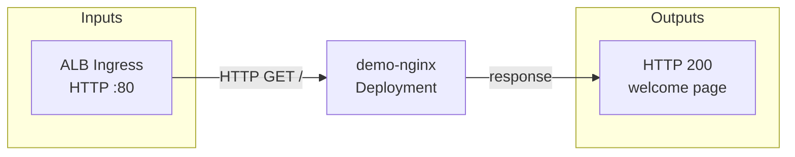

# demo-nginx

Static nginx web server used as a platform smoke-test. Serves the default nginx welcome
page behind an ALB Ingress on both clusters.

## Inputs and outputs



| Input | Type | Detail |
| --- | --- | --- |
| ALB Ingress | HTTP | Port 80, path `/`, hostname per environment |

| Output | Type | Detail |
| --- | --- | --- |
| HTTP response | Static HTML | Default nginx welcome page |

## Image

| Source | ECR |
| --- | --- |
| `public.ecr.aws/nginx/nginx:1.27` | `111122223333.dkr.ecr.ap-southeast-2.amazonaws.com/demo-nginx:1.27` |

Retag and push before first deploy:

```text
docker pull public.ecr.aws/nginx/nginx:1.27
docker tag public.ecr.aws/nginx/nginx:1.27 111122223333.dkr.ecr.ap-southeast-2.amazonaws.com/demo-nginx:1.27
docker push 111122223333.dkr.ecr.ap-southeast-2.amazonaws.com/demo-nginx:1.27
```

## IAM

No AWS API calls. No `iam.tf` required.

## Networking

| Direction | Target | Port | Policy |
| --- | --- | --- | --- |
| Egress | kube-system DNS | 53 UDP/TCP | `allow-dns-egress` |
| Egress | Any | 443 TCP | `allow-https-egress` |
| Ingress | ALB | 80 TCP | `allow-ingress-alb` |

## Hostnames

| Cluster | Hostname |
| --- | --- |
| dev-eks-1 | `demo-nginx.dev.example.com` |
| prod-eks-1 | `demo-nginx.prod.example.com` |
