# Walkthrough: Kiro EKS migration factory

Visual walkthrough of a gated EKS + Argo CD migration factory. Follow the screenshots
in order. Commands are only where you need to run something.

Slideshow: [`slideshow.html`](media/walkthrough/slideshow.html).

---

## Why this exists

Manual GitOps onboarding does not scale. For ~100 containerized web apps:

| Path | Per app | For 100 apps |
| --- | --- | --- |
| Manual (experienced) | ~3-6 h | ~450 h |
| Manual (mixed) | ~1-2 days | ~150 person-days |
| Factory + Kiro + review | ~45-90 min | ~75-150 h after setup |

The factory removes re-deciding tree shape and silent drift. It does **not** remove
workload understanding, IAM shrink, DNS/TLS, or cutover risk.

**Human gate:** accelerate drafting; do not merge or promote to prod without review.
Blind deploy can mean downtime, over-broad IAM, or higher run cost.

---

## Setup

```bash
git clone https://github.com/jajera/kiro-eks-argocd-migration.git
cd kiro-eks-argocd-migration
./scripts/install-gator.sh "$HOME/.local/bin"
export PATH="$HOME/.local/bin:$PATH"
```

Need: `kustomize`, `gator` 3.22.0, Node/`npx`, Kiro (for Lab C).

---

## Lab A - Offline admission

```bash
gator verify infrastructure/gatekeeper/tests/...
kustomize build policies/overlays/dev-eks-1 >/dev/null
kustomize build policies/overlays/prod-eks-1 >/dev/null
```

Expect: all suites `ok`, final `PASS`.

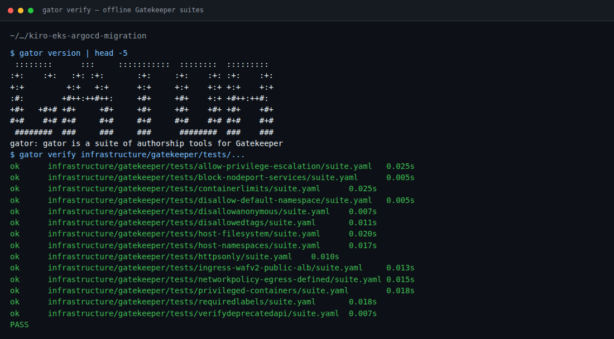

---

## Lab B - `.kiro/` config map

The `.kiro/` directory is where Kiro's behaviour becomes project-specific. Think
of it as a layered contract: steering supplies the knowledge, skills encode the
procedures, hooks enforce the rules, and the agent bundles everything so a simple
prompt activates the full stack.

Rendered stills of what lives under `.kiro/` (not the live Kiro IDE).
One caption per frame.

```bash
node docs/media/walkthrough/capture-kiro-configs.mjs
```

### Steering - the knowledge layer

Steering files are markdown documents loaded into context. They tell Kiro *how*
to write YAML rather than *what* YAML to write. Six files, two inclusion modes:

| File | Inclusion | Purpose |
| --- | --- | --- |
| `project-profile.md` | always | Clusters, accounts, region, ECR shape, defaults |
| `gitops-conventions.md` | always | Kustomize layout, naming, labels, images, NetworkPolicy |
| `workload-archetypes.md` | conditional (`apps/**`) | Five archetypes and their required inputs |
| `identity-and-secrets.md` | conditional (`apps/**`) | `iam.tf` shape, Pod Identity, SecretProviderClass |
| `policy-validation.md` | conditional (`apps/**`) | Gatekeeper policy checks, `gator` usage |
| `ci-workflows.md` | conditional (`.github/**`) | CI pipeline reference |

"Always" files load on every interaction - they are cheap enough to justify
the context budget. Conditional files load only when the conversation touches
their file patterns, keeping the context window clean during unrelated work.

**1 - Repo layout** - platform + `.kiro/` on disk.

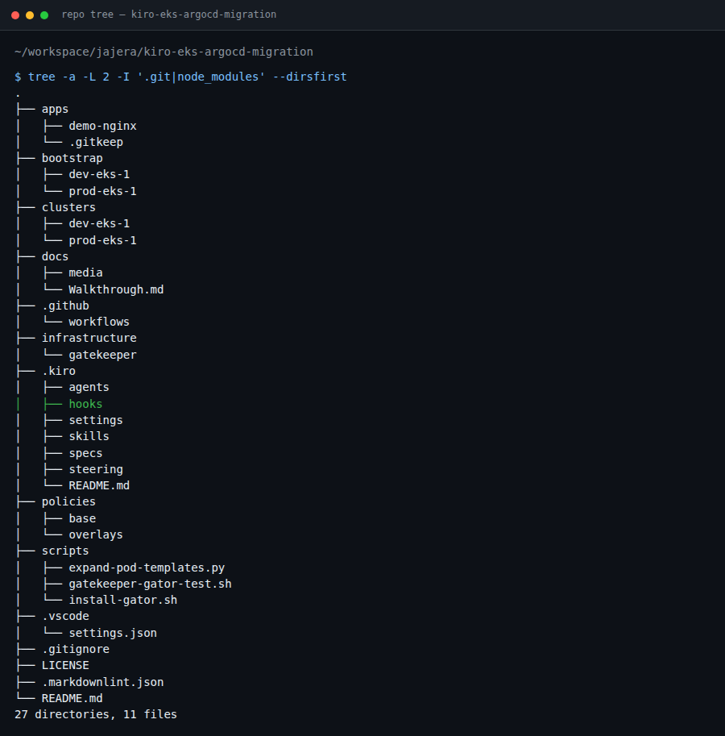

**2 - `.kiro/` tree** - steering, skills, hooks, agent, MCP, specs.

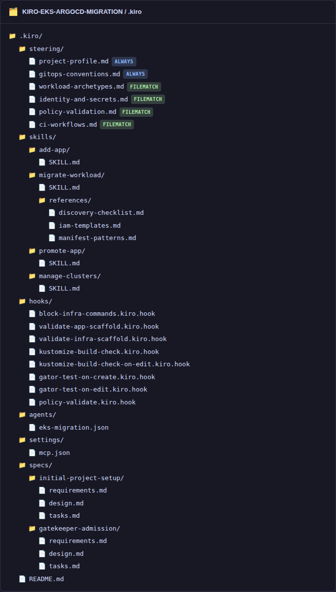

**3 - project-profile** - always-on env keys (clusters, region, policy engine).
Every other file references these keys by name. If a value is still a placeholder,
Kiro asks before generating files.

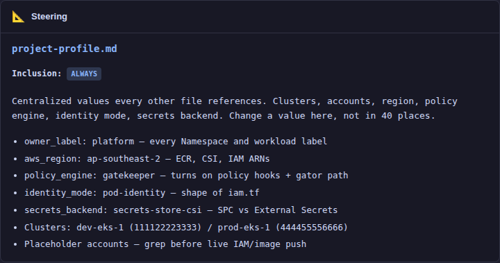

**4 - Conditional steering** - archetypes / identity / policy load only when
a file under `apps/**` enters the conversation. This is how Kiro knows that a
`web-service` needs probes and an Ingress, or that a `queue-worker` needs a
`ScaledObject`, without those rules consuming budget during cluster work.

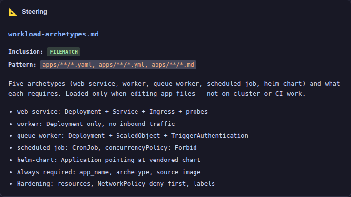

### Skills - the procedure layer

Skills are ordered workflows with a stopping condition. Steering says
"every app needs both overlays"; the `add-app` skill says "create base,
then dev overlay, then prod overlay, then validate." The distinction
matters: duplicating a procedure into steering means it loads on every
interaction and drifts from the skill.

Four skills in this repo:

| Skill | Trigger intent | Key behaviour |
| --- | --- | --- |
| `add-app` | "add a new app", "create a service" | Scaffold base + both overlays + validate |
| `migrate-workload` | "migrate from EC2/ECS/Compose" | Eight gated phases; discovery before scaffold |
| `promote-app` | "ship to prod", "promote" | Copy verified digest from dev to prod overlay |
| `manage-clusters` | "bootstrap", "add an add-on" | Cluster config + ApplicationSet changes |

`migrate-workload` uses progressive disclosure: the SKILL.md body carries the
phase workflow, and `references/` holds supplementary detail (manifest patterns,
containerisation guides) loaded only when the relevant phase starts.

**5 - add-app skill** - scaffold contract + validation gate.

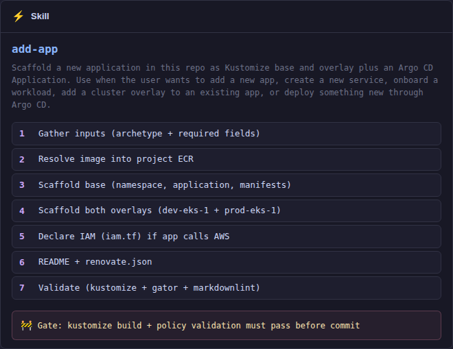

**6 - migrate-workload skill** - gated phases; no skipping unknowns.

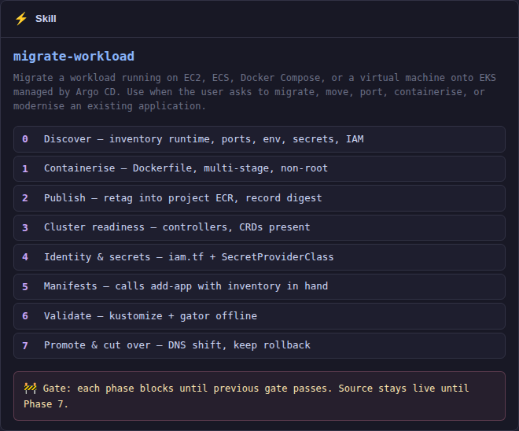

### Hooks - the enforcement layer

Hooks fire on IDE events and either prompt Kiro (askAgent) or run a shell
command (runCommand). They are the guardrails that run *during* a session,
not *after* it.

Eight hooks, three categories:

| Category | Hooks | Fires on |
| --- | --- | --- |
| Shell gate | `block-infra-commands` | `preToolUse` (shell) - deny/allow list for mutating commands |
| Scaffold checks | `validate-app-scaffold`, `validate-infra-scaffold` | `fileEdited` under `apps/**` or `infrastructure/**` |
| Build/policy | `kustomize-build-check`, `kustomize-build-check-on-edit`, `gator-test-on-create`, `gator-test-on-edit`, `policy-validate` | `fileCreated` / `fileEdited` on manifests and kustomizations |

The shell gate is the most critical: it inspects every shell command before
execution and denies anything that could mutate a live cluster, cloud account,
or registry. This repo is Git-only - changes reach clusters via Argo CD after
merge, never via agent apply.

**7 - Hooks grid** - scaffold checks, policy checks, shell deny.

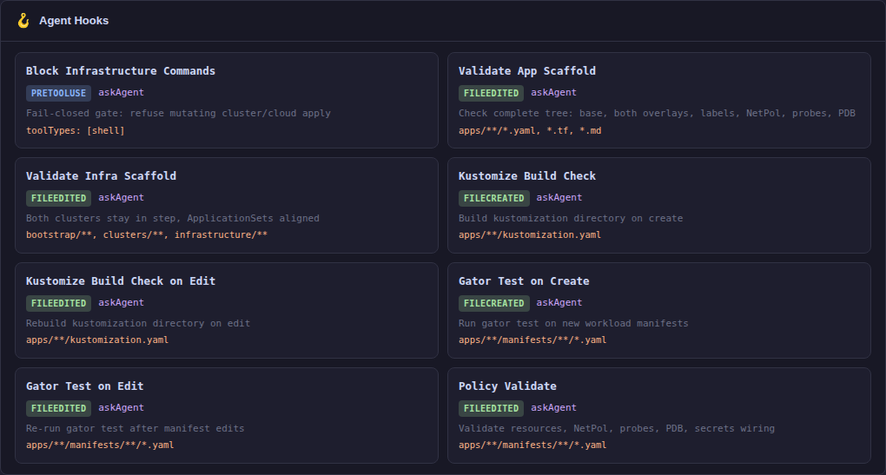

**8 - PDB scar** - `replicas: 1` must not keep `minAvailable: 1`.
This is encoded in both the steering *and* the `validate-app-scaffold` hook,
so it fires whether you are reading conventions or editing a Deployment.

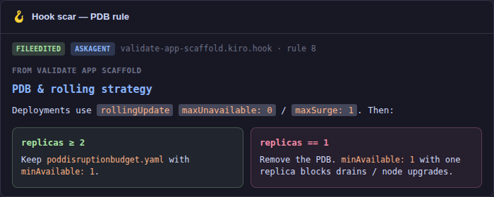

### Agent - the bundle

The `eks-migration` agent is a JSON file that wires steering and skills
together so a single Kiro session activates the full factory without
manual setup:

```json
{
  "name": "eks-migration",
  "tools": ["*"],
  "resources": [
    "file://.kiro/steering/*.md",
    "skill://.kiro/skills/*/SKILL.md"
  ]
}
```

All steering files and all skill entry points are available to the agent.
Hooks fire independently (they are IDE-level, not agent-level), so the
agent does not need to reference them - they enforce regardless.

**9 - Agent** - `eks-migration` bundles steering + skills.

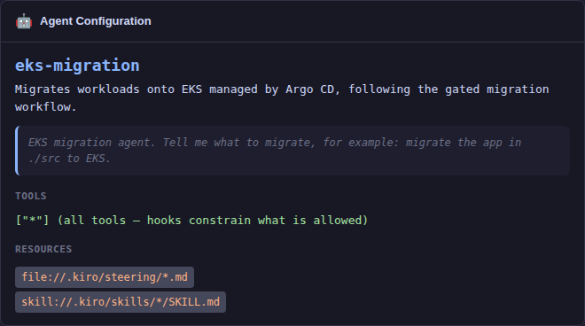

### MCP - external context

Model Context Protocol servers give Kiro access to external information
without baking it into steering files that go stale:

| Server | Purpose | Default state |
| --- | --- | --- |
| `aws-knowledge` | AWS docs search (no credentials needed) | enabled |
| `eks` | Cluster/K8s resource inspection, read-only | disabled until creds exist |
| `kubernetes` | Live cluster state, non-destructive only | disabled until creds exist |
| `filesystem` | Local file access | enabled |

The `eks` server is locked to `--read-only` and the `kubernetes` server
sets `ALLOW_ONLY_NON_DESTRUCTIVE_TOOLS=true`. Combined with the shell gate
hook, there is no path from the agent to a live cluster mutation.

**10 - MCP** - docs on; live cluster adapters off until creds exist.

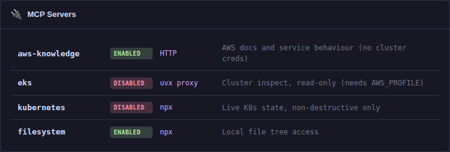

### Specs - structured design history

Specs are the alternative to vibe coding for complex features. Each spec
lives at `.kiro/specs/<feature>/` with three documents:

- `requirements.md` - user stories and acceptance criteria
- `design.md` - architecture and layout decisions
- `tasks.md` - ordered implementation steps with checkboxes

This repo has two specs (`initial-project-setup`, `gatekeeper-admission`)
that document how the platform itself was built. They persist as reviewable
project history, not ephemeral chat. See "Vibe vs Spec" in Lab C for when
each mode fits.

**11 - Specs** - structured requirements/design/tasks that persist as project
documentation.

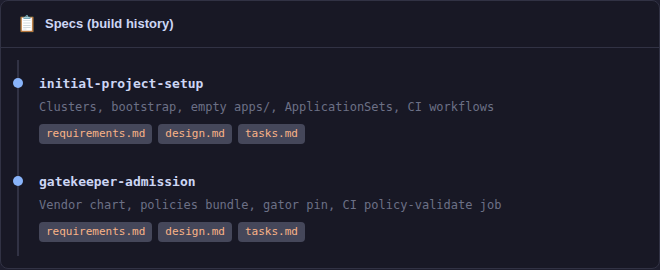

### How the layers connect

```text
Prompt -> Agent (loads steering + skills)
            |
            v
         Skill (orders the work)
            |
            v
         File writes -> Hooks fire (validate, build, gate)
            |
            v
         Commit -> PR -> Human review -> Merge -> Argo CD sync
```

Remember: **skills generate -> hooks enforce -> humans approve.**

---

## Lab C - Kiro onboarding (`add-app`)

Do **not** hand-write the app. Start from empty `apps/`.
Use the `eks-migration` agent.
Stills below are full Kiro IDE frames from the Lab C recording
(individual shots - not a montage).

**1 - Thin prompt** - paste this in Kiro:

```text
Add a web-service app named demo-nginx.
Image: public.ecr.aws/nginx/nginx:1.27 (retag into our ECR as demo-nginx).
No Secrets Manager. Egress: DNS + HTTPS as required for probes.
Ingress: yes, hostname demo-nginx.dev.example.com on alb.
Replicas: 2 in both overlays (so PDB minAvailable: 1 is valid).
```

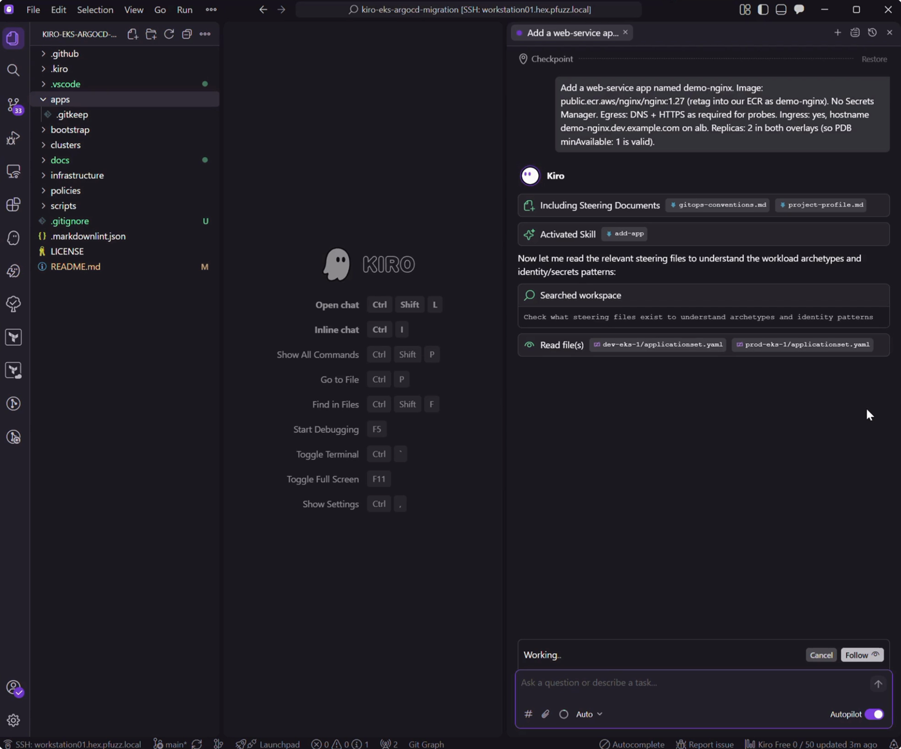

**2 - Scaffolding** - `add-app` creating `apps/demo-nginx/` (explorer + chat).

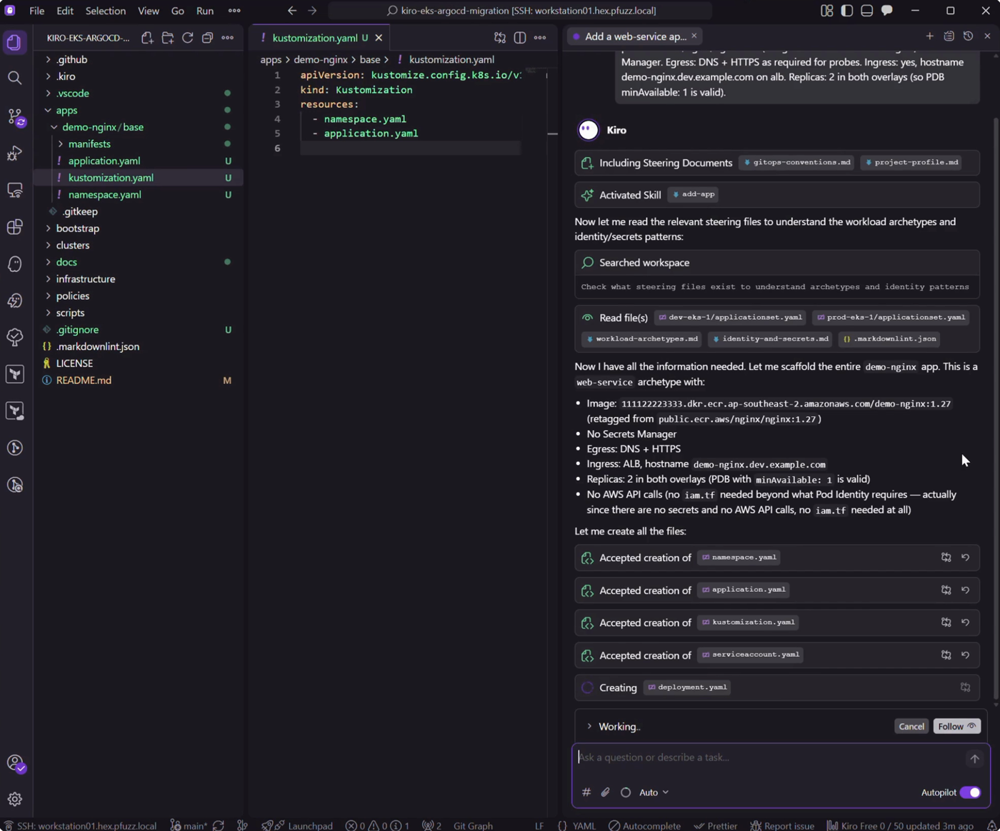

**3 - Git-only hook** - `Block Infrastructure Commands` evaluates shell.
`kustomize build` is on the ALLOW list and proceeds (read-only).
A live `kubectl apply` deny was not in this recording - capture that
separately if you want an ACCESS DENIED still.

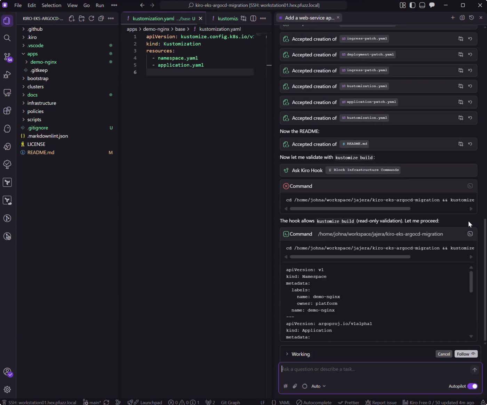

**4 - Verify** - Kiro ran `kustomize` + `markdownlint`; both passed.

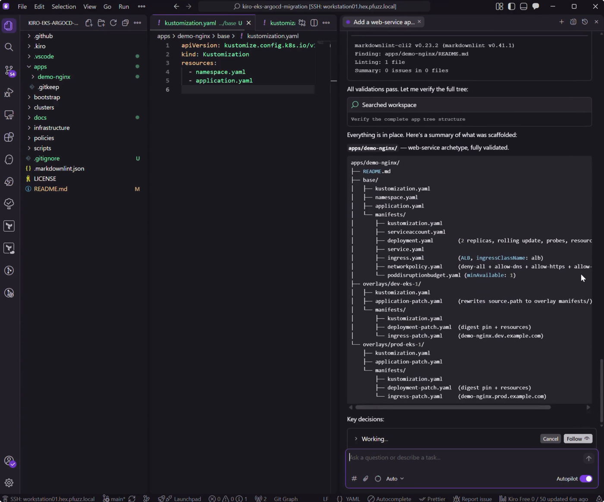

**5 - Done** - dual overlays in explorer + summary (all changes accepted).

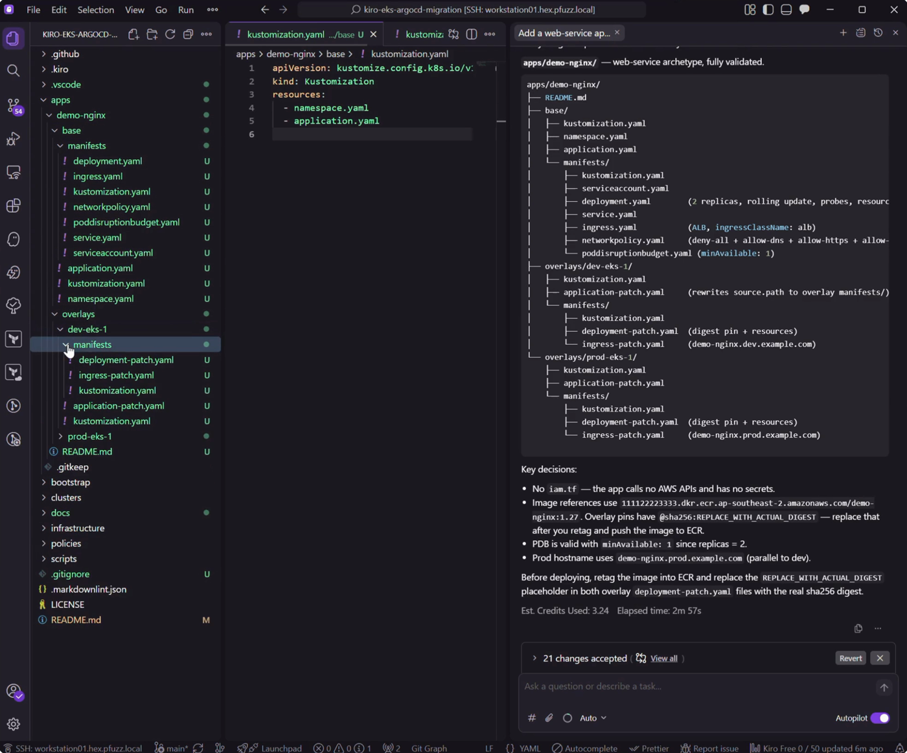

**6 - PR checks** - same gates as local (auto still until you swap).

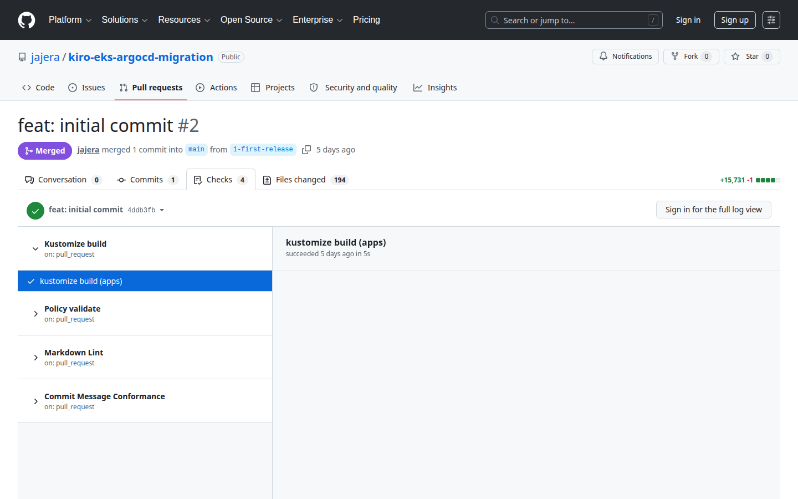

### Takeaway - vibe prompt, factory result

This session was **vibe coding**: Autopilot on, a short natural-language
ask, no hand-authored manifests. The output still matched the platform
contract because the repo's guardrails did the heavy lifting:

- **Steering** (`project-profile`, gitops conventions, archetypes) supplied
  clusters, labels, ECR shape, and what a web-service must include.
- **`add-app` skill** ordered the work: both overlays, kind-named files,
  probes, NetPol, PDB rules, README - not a one-shot dump.
- **Hooks** enforced the Git-only shell gate and kept validation
  (`kustomize`, `markdownlint`) on the path before "done".
- **Agent bundle** (`eks-migration`) wired those pieces so the thin prompt
  did not have to restate the factory.

Vibe gets you speed. The `.kiro/` map from Lab B is why speed did not
become drift: dual overlays, placeholder digests, no broad IAM, PDB valid
at replicas 2. Humans still review before merge.

### Vibe vs Spec - when to use which

Kiro supports two session types and the difference matters more than it
first appears.

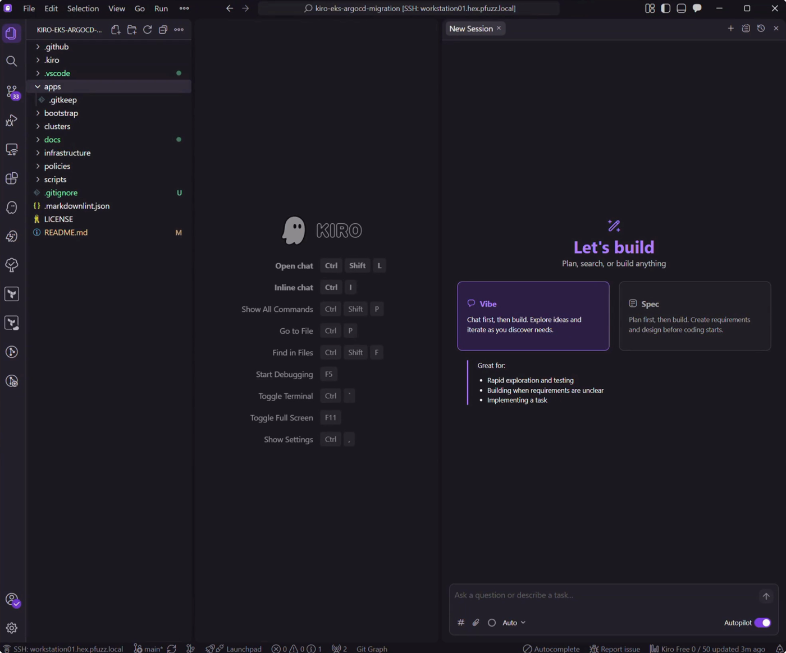

| Dimension | Vibe (Lab C above) | Spec-driven |
| --- | --- | --- |
| Input | One natural-language prompt | Structured requirements -> design -> tasks |
| Feedback loop | After the fact (PR review) | Before code (requirement refinement, acceptance criteria) |
| Traceability | Chat history | Versioned `requirements.md`, `design.md`, `tasks.md` in `.kiro/specs/` |
| Best for | Well-understood archetypes with strong steering | Novel infrastructure, complex acceptance criteria, multi-stakeholder sign-off |
| Risk surface | Reviewer catches drift at PR time | Drift is caught at spec-authoring time, before a line of code |

#### What a spec-driven session looks like

Instead of a thin prompt you start a Spec session and Kiro walks through
three documents:

1. **`requirements.md`** - user stories, acceptance criteria, glossary,
   scope/out-of-scope. Example: the `gatekeeper-admission` spec in this
   repo has 13 requirements with testable criteria before any YAML exists.
2. **`design.md`** - directory layout, resource relationships, sync-wave
   ordering, Kustomize patch strategy. Reviewed and approved before
   implementation begins.
3. **`tasks.md`** - ordered implementation steps derived from the design.
   Kiro executes them one at a time, marking each complete. Hooks still
   fire (policy checks, shell gate) at every task boundary.

The spec lives at `.kiro/specs/<feature>/` and becomes permanent project
documentation - not ephemeral chat.

#### When vibe is the right call

- The archetype is known and steering already encodes the contract
  (web-service, worker, queue-worker, scheduled-job).
- The ask maps cleanly to an existing skill (`add-app`, `promote-app`).
- Speed matters more than upfront negotiation - you trust the guardrails
  and will review at PR time.

Lab C is a textbook case: `demo-nginx` is a vanilla web-service, the
`add-app` skill already knows the tree shape, and steering supplies every
default. A spec session would produce the same files with an extra 10-15
minutes of requirements writing for no additional safety.

#### When spec-driven earns its keep

- The feature touches multiple systems or introduces new patterns (the
  Gatekeeper admission stack needed 13 requirements because it spans
  operator install, policy bundle, gator tests, CI workflow, bootstrap
  wiring, and steering updates - all coordinated).
- Acceptance criteria are non-obvious or contentious (sync-wave ordering,
  enforcement-action promotion gates, excluded-namespace lists).
- Multiple people need to approve the approach before implementation
  starts - the spec is the review artifact, not the PR diff.
- You want the implementation to be resumable across sessions. A spec with
  task checkboxes lets Kiro (or a different engineer) pick up exactly where
  work stopped.

#### They compose, not compete

A common pattern in this repo:

1. **Spec session** builds the platform (Gatekeeper, bootstrap, cluster
   config, steering, hooks).
2. **Vibe sessions** onboard apps on top of that platform - the spec
   already encoded the contract into steering and skills.

The spec front-loads decisions into reviewable documents. Vibe exploits
those decisions at execution time. Neither mode bypasses the human gate:
specs are reviewed before implementation starts; vibe output is reviewed
before merge.

---

## Lab D - Live path (visual checklist)

Only after human PR review. Git merge -> Argo CD sync. No chat apply.

| Step | Capture | Pass when |
| --- | --- | --- |
| Placeholders / ECR image ready | - | real account IDs, digest in ECR |
| IAM applied if needed | - | Pod Identity association exists |
| Argo parent + child | `23-argocd-healthy.png` | `Synced` / `Healthy` |
| Ingress ADDRESS | `24-alb-ingress.png` | ALB hostname present |
| curl host | `25-curl-ok.png` | HTTP 200 |
| Promote to prod overlay | - | same digest only after above |

```bash
argocd app get demo-nginx-dev-eks-1
argocd app get demo-nginx
kubectl -n demo-nginx get deploy,svc,ingress,pdb
kubectl -n demo-nginx get ingress demo-nginx -o wide
curl -sS -o /dev/null -w "%{http_code}\n" https://demo-nginx.dev.example.com/
```

Drop Lab D stills into `docs/media/walkthrough/` when you have a live cluster.

---

## Autonomy modes

Lab C ran in **Autopilot** (the default). Kiro also supports **Supervised**
mode, which yields for approval after each turn that edits files. Changes
are presented as individual hunks you can accept or reject.

When to switch:

- **Autopilot** - scaffolding a known archetype, running validation, bulk
  file creation. The hooks and PR review are your safety net.
- **Supervised** - editing live bootstrap manifests, modifying policy
  enforcement actions, anything where a single wrong line could block
  cluster syncs. You review each hunk before it lands on disk.

Both modes respect hooks (the shell gate still fires in Supervised) and
both require a human merge before Argo CD sees anything.

---

## Done

| Lab | Evidence |
| --- | --- |
| A | gator `PASS` |
| B | `.kiro/` config map reviewed |
| C | thin prompt -> scaffold -> hook -> verify -> done |
| D | Argo healthy, ALB, curl 200, then promote |

Production stays a human gate.

---

## Media

```bash
node docs/media/walkthrough/capture.mjs
node docs/media/walkthrough/capture-kiro-configs.mjs
```

| Frames | Who |
| --- | --- |
| `01`, `09`, `13` | `capture.mjs` |
| `08`, `14`-`22` | `capture-kiro-configs.mjs` |
| `07`, `10`, `10-vibe-mode`, `10b`, `11`, `12-add-app-done` | Lab C recording |
| `23`-`25` | You on live cluster |
